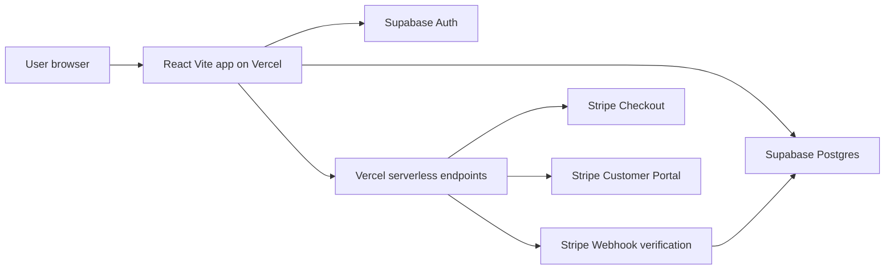
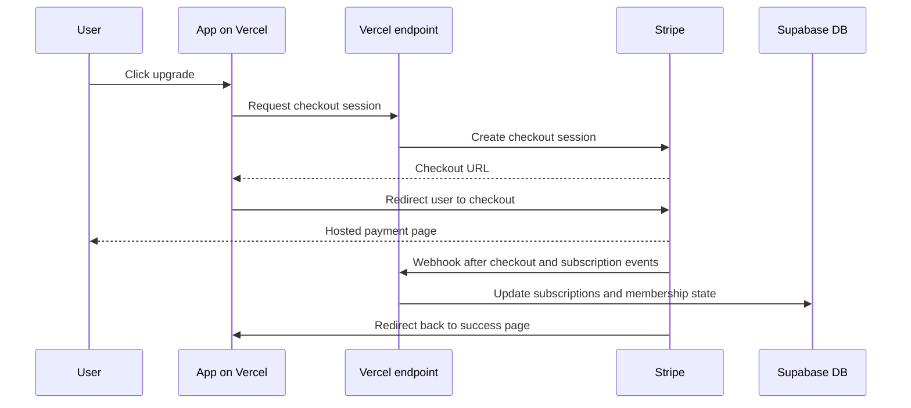

# Retro Drive-In infrastructure plan

## Current app baseline

The current project is a static React + Vite frontend with build and preview scripts defined in [package.json](package.json).

- Dev server: [`dev`](package.json:7)
- Production build: [`build`](package.json:8)
- Local preview: [`preview`](package.json:9)

This means the frontend is a good fit for deployment on Vercel as a static app, while runtime account and billing features are handled by external services.

## Target architecture



## Responsibilities by platform

### Vercel
- Hosts the built frontend from the Vite output
- Hosts serverless endpoints for Stripe session creation and webhook handling
- Stores deployment environment variables
- Provides production hosting for the custom domain

### Supabase
- Handles user authentication with email and password
- Stores user profile data
- Stores membership and billing reference data
- Enforces row-level security so users only read or update their own records

### Stripe
- Handles monthly paid subscription checkout
- Stores payment methods and card details
- Manages invoices and prior charge history
- Provides hosted billing management through the customer portal

## Membership model

The application supports two user states:

1. Free membership
2. Paid membership

### Free membership
- User signs up through Supabase Auth
- User has a profile row in the database
- User has access to free-tier features
- No Stripe subscription is required

### Paid membership
- User signs up through Supabase Auth
- User upgrades through Stripe Checkout
- Stripe creates a customer and subscription
- Webhook processing updates membership status in the database
- User can manage billing through Stripe Customer Portal

## Security boundaries

### Never store in app tables
- Raw password values
- Password hashes managed manually
- Full credit card numbers
- CVV values
- Expiration details as payment records
- Stripe secret keys in frontend code

### Safe storage model
- Passwords are managed by Supabase Auth
- Card details are managed by Stripe
- Frontend uses public Supabase URL and anon key only
- Stripe secret key is used only in server-side Vercel endpoints

## Initial database design

### Auth model
Supabase Auth is the source of truth for login identity.

- Email lives in Supabase Auth
- Password is managed by Supabase Auth
- Auth user id is used as the foreign key for application records

### Table: `profiles`
Purpose: business profile data for each account.

Suggested columns:

- `id uuid primary key` referencing the auth user id
- `email text unique`
- `first_name text not null`
- `last_name text not null`
- `phone text`
- `membership_type text not null default 'free'`
- `created_at timestamptz not null default now()`
- `updated_at timestamptz not null default now()`

Suggested constraint:

- `membership_type` allowed values: `free`, `paid`

### Table: `subscriptions`
Purpose: Stripe subscription references and access status.

Suggested columns:

- `id uuid primary key default gen_random_uuid()`
- `user_id uuid not null`
- `stripe_customer_id text unique`
- `stripe_subscription_id text unique`
- `plan_code text not null`
- `status text not null`
- `current_period_end timestamptz`
- `cancel_at_period_end boolean not null default false`
- `created_at timestamptz not null default now()`
- `updated_at timestamptz not null default now()`

Suggested relationships:

- `user_id` references `profiles.id`

Suggested status examples:

- `incomplete`
- `trialing`
- `active`
- `past_due`
- `canceled`
- `unpaid`

### Table: `billing_events`
Purpose: optional local reporting for invoice and charge history references.

Suggested columns:

- `id uuid primary key default gen_random_uuid()`
- `user_id uuid not null`
- `stripe_customer_id text`
- `stripe_invoice_id text`
- `stripe_payment_intent_id text`
- `event_type text not null`
- `amount numeric`
- `currency text`
- `status text`
- `paid_at timestamptz`
- `metadata jsonb not null default '{}'::jsonb`
- `created_at timestamptz not null default now()`

Use this table for internal reporting or account views if needed later. For MVP, Stripe Customer Portal can handle most billing history needs.

## Row-level security model

Enable RLS on all application tables.

### `profiles` policies
- A user can select only their own row
- A user can insert only a row whose `id` matches their auth id
- A user can update only their own row
- A user cannot directly elevate protected billing state outside approved flows

### `subscriptions` policies
- A user can read only their own subscription records
- Direct user updates should be restricted
- Writes should come from trusted server-side logic or admin/service role operations

### `billing_events` policies
- A user can read only their own billing records
- User inserts and updates should be blocked
- Writes should come from webhook processing only

## Stripe integration model

### Checkout flow


### Customer portal flow
- Authenticated user clicks Manage Billing
- Frontend calls a Vercel endpoint
- Endpoint creates a Stripe billing portal session
- User is redirected to the Stripe-hosted portal
- After billing actions, user returns to the app

### Webhook responsibilities
Webhook processing should:

- verify Stripe signature
- handle subscription created and updated events
- handle invoice payment success and failure events
- upsert `subscriptions`
- optionally append `billing_events`
- update `profiles.membership_type` only when business rules allow it

## Recommended business rules

### Account creation
- Every new user starts as `free`
- A profile row is created immediately after signup

### Upgrade to paid
- User remains authenticated in the app
- Paid access becomes active only after confirmed Stripe webhook processing
- Do not trust the frontend alone to mark a user as paid

### Downgrade or cancellation
- If subscription is canceled but still active through the billing period, keep paid access until `current_period_end`
- When Stripe indicates the paid entitlement is over, set membership back to `free`

## Environment variables

### Frontend variables for Vercel
Expose only public values to the client.

- `VITE_SUPABASE_URL`
- `VITE_SUPABASE_ANON_KEY`

### Server-only Vercel variables
Keep these private.

- `SUPABASE_SERVICE_ROLE_KEY` only if required for privileged writes
- `STRIPE_SECRET_KEY`
- `STRIPE_WEBHOOK_SECRET`
- `STRIPE_PRICE_ID_MONTHLY`
- `APP_BASE_URL`

## Vercel deployment setup

### Build settings
- Framework preset: Vite
- Build command: [`npm run build`](package.json:8)
- Output directory: `dist`

### Domain setup
- Add the purchased domain in the Vercel project
- Configure DNS records at the registrar using Vercel instructions
- Force HTTPS and redirect to a single canonical domain

## Supabase setup checklist

1. Create a new Supabase project
2. Enable email and password auth
3. Create `profiles`, `subscriptions`, and optionally `billing_events`
4. Enable RLS on all tables
5. Add user-scoped policies
6. Add trigger or application flow to create profile rows after signup
7. Store Supabase project URL and anon key in Vercel and local env files

## Stripe setup checklist

1. Create a Stripe account
2. Create one recurring monthly product and price
3. Configure Stripe Checkout for subscription mode
4. Configure Customer Portal
5. Create webhook endpoint targeting a Vercel serverless route
6. Subscribe webhook to required events
7. Store Stripe keys and price id in Vercel environment variables

## Application implementation plan

### Phase 1
- Add Supabase client configuration
- Add signup, login, logout, and session persistence
- Add protected account page
- Create and edit profile data in `profiles`

### Phase 2
- Add upgrade button for paid membership
- Add serverless endpoint to create Stripe Checkout session
- Add success and cancel return pages
- Add Stripe webhook endpoint
- Sync paid status into `subscriptions` and `profiles`

### Phase 3
- Add Manage Billing button using Stripe Customer Portal
- Add membership status UI
- Optionally add local billing history view backed by `billing_events`

## Suggested project structure additions

```text
src/
  lib/
    supabase.js
  auth/
    AuthProvider.jsx
  pages/
    LoginPage.jsx
    SignupPage.jsx
    AccountPage.jsx
    BillingPage.jsx
api/
  create-checkout-session.js
  create-customer-portal-session.js
  stripe-webhook.js
```

## Launch readiness checklist

- Vercel production deploy works from the main branch
- Supabase auth email flow is tested
- RLS policies prevent cross-user data access
- Stripe test mode checkout works end to end
- Webhook updates membership state correctly
- Free and paid access states are reflected correctly in UI
- Custom domain resolves over HTTPS

## Recommended first implementation scope

Start with the minimum complete slice:

1. Supabase Auth with email and password
2. `profiles` table with free membership default
3. Paid upgrade button using one Stripe monthly plan
4. Stripe Customer Portal for billing history and payment management
5. Vercel deployment with environment variables configured

This gives a launchable membership foundation without overengineering.

## Approval gate before coding

The implementation phase should begin only after you approve:

- the two-tier membership model
- Stripe-hosted billing flows
- the proposed tables and RLS boundaries
- Vercel as the deployment target
